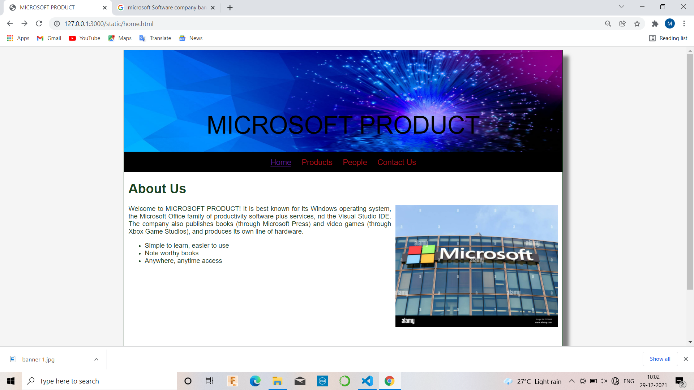
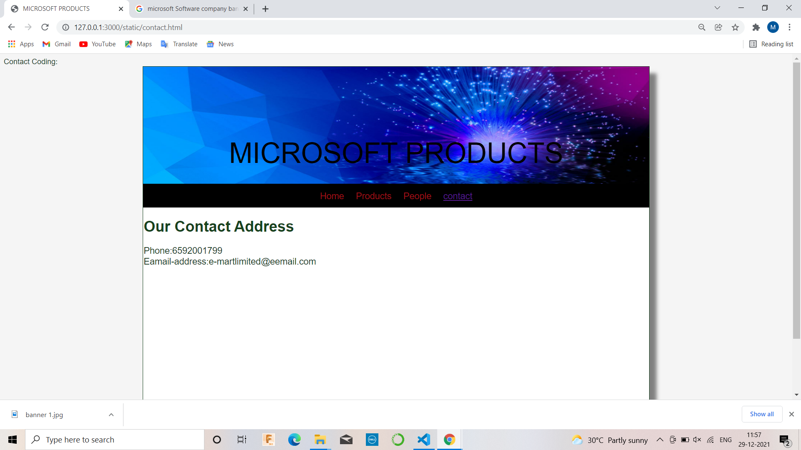

# Web Design for a Software Product Company

## AIM:

To design a static website for a software product company company.

## DESIGN STEPS:

### Step 1:

Requirement collection.

### Step 2:

Creating the layout using HTML and CSS.

### Step 3:

Updating the sample content.

### Step 4:

Choose the appropriate style and color scheme.

### Step 5:

Validate the layout in various browsers.

### Step 6:

Validate the HTML code.

### Step 6:

Publish the website in the given URL.

## PROGRAM :
HOME.HTML
```
<!DOCTYPE html>
<html lang="en">
  <head>
    <title>MICROSOFT PRODUCT</title>
    <link rel="stylesheet" href="./css/layout.css" />
    <link rel="icon" href="./img/icon.png" type="image/x-icon" />
  </head>

  <body>
    <div class="container">
      <div class="banner">MICROSOFT PRODUCT</div>
      <div class="menu">
        <div class="menuitemselected"><a href="/static/home.html">Home</a></div>
        <div class="menuitem"><a href="/static/products.html">Products</a></div>
        <div class="menuitem"><a>People</a></div>
        <div class="menuitem"><a>Contact Us</a></div>
      </div>
      <div class="content">
        <div class="homecontent">
          <h1>About Us</h1>
          
          <div class="contenttext">
            At Tally, we believe in the power of technology to make business
            owners efficient, empowered and happier, so they can focus on what
            matters most for their business. We design our products to focus on
            just that to make our products work for you, and not the other way
            around.
            <br />
            Our new product TallyPrime takes this to a new level, making your
            start to automation, or your switch to Tally simpler than ever
            before. You can now discover the product much more easily and make
            the product do more for you, without learning anything new. There is
            greater flexibility as the product adapts to your business and your
            way of working. And the transformed look and feel will only make you
            love the product even more.
            <ul>
              <li>Simple to learn, easier to use</li>
              <li>Insightful , actionable & customizable reports</li>
              <li>Anywhere, anytime and secure access</li>
            </ul>
          </div>
        </div>
      </div>
      <div class="footer">
        Copyright &#169; 2021 microsoft product, Developed by Meiyarasi.V
      </div>
    </div>
  </body>
</html>
```
PRODUCTS.HTML
```
<!DOCTYPE html>
<html lang="en">
  <head>
    <title>MICROSOFT PRODUCT</title>
    <link rel="stylesheet" href="./css/layout.css" />
    <link rel="icon" href="./img/icon2.png" type="image/x-icon" />
  </head>

  <body>
    <div class="container">
      <div class="banner">MICROSOFT PRODUCT</div>
      <div class="menu">
        <div class="menuitem"><a href="/static/home.html">Home</a></div>
        <div class="menuitemselected"><a href="/static/products.html">Products</a></div>  
        <div class="menuitem"><a href="/static/people.html">People</a></div>
        <div class="menuitem"><a href="/static/contact us.html">Contact Us</a></div>
      </div>
      <div class="content">
        <div class="productcontent">    
          <h1>Our Premium Products</h1>
          <div class="productitems">

              <div class="productitem"> 
                  <div class="itemimage">
                  
                  </div>
                  <div class="itemname">access</div>
                  <div class="itemprice">Price:Rs.10,000</div>
              </div>

              <div class="productitem"> 
                  <div class="itemimage">
                  
                  </div>
                  <div class="itemname">azur</div>
                  <div class="itemprice">Price:Rs.8999</div>
              </div>

              <div class="productitem"> 
                  <div class="itemimage">
                  
                  </div>
                  <div class="itemname">clouds/div>
                  <div class="itemprice">Price: Rs.7599 </div>
              </div>

              <div class="productitem"> 
                <div class="itemimage">
                
                </div>
                <div class="itemname">edge</div>
                <div class="itemprice">Price: 5599 </div>
            </div>

            <div class="productitem"> 
              <div class="itemimage">
              
              </div>
              <div class="itemname">exel</div>
              <div class="itemprice">Price: Rs.700.00 </div>
          </div>

          <div class="productitem"> 
            <div class="itemimage">
            
            </div>
            <div class="itemname">word</div>
            <div class="itemprice">Price: Rs.859 </div>
        </div>

        <div class="productitem"> 
          <div class="itemimage">
          
          </div>
          <div class="itemname">publisher</div>
          <div class="itemprice">Price: Rs.500.00 </div>
      </div>

      <div class="productitem"> 
        <div class="itemimage">
        
        </div>
        <div class="itemname">share point</div>
        <div class="itemprice">Price: Rs.759 </div>
    </div>

    <div class="productitem"> 
      <div class="itemimage">
      
      </div>
      <div class="itemname">skype</div>
      <div class="itemprice">Price: Rs.1999 </div>
    </div>

    <div class="productitem"> 
       <div class="itemimage">
       
       </div>
       <div class="itemname">SQL server</div>
       <div class="itemprice">Price: Rs.2229.00 </div>
    </div>
    <div class="productitem"> 
      <div class="itemimage">
      
    </div>
       <div class="itemname">store</div>
       <div class="itemprice">Price: Rs.789 </div>
    </div>

    <div class="productitem"> 
      <div class="itemimage">
      
     </div>
        <div class="itemname">one note</div>
        <div class="itemprice">Price: Rs.2559 </div>
      </div>
    </div>
  </div>        
  </div>
    <div class="footer">
      Copyright &#169; 2021 microsoft product, Developed by Meiyarasi.V
    </div>
  </div>
 </body>
</html>
```
CONTACT.HTML
```
<!DOCTYPE html>
<html lang="en">
  <head>
    <title>MICROSOFT PRODUCTS</title>
    <link rel="stylesheet" href="./css/layout.css" />
    <link rel="icon" href="./img/icon2.png" type="image/x-icon" />
  </head>

  <body>
    <div class="container">
      <div class="banner">MICROSOFT PODUCTS</div>
      <div class="menu">
        <div class="menuitem"><a href="/static/home.html">Home</a></div>
        <div class="menuitem"><a href="/static/products.html">Products</a></div>  
        <div class="menuitem"><a href="/static/people.html">People</a></div>
        <div class="menuitemselected"><a href="/static/contact us.html">Contact Us</a></div>
      </div>
      
        <div class="contact content">
           <h1>Our Contact Address</h1>  
        
          <div class="contacttext">
           Phone:6592001799
           <br>Eamail-address:e-martlimited@eemail.com
          </div>
        </div>
        <div class="footer">
  Copyright &#169; 2021 microsoft product, Developed by Meiyarasi.V
</div>
</div>
</body>
</html>
```
PEOPLE.HTML
```
<!DOCTYPE html>
<html lang="en">
  <head>
    <title>MICROSOFT PRODUCT</title>
    <link rel="stylesheet" href="./css/layout.css" />
    <link rel="icon" href="./img/icon2.png" type="image/x-icon" />
  </head>

  <body>
    <div class="container">
      <div class="banner">MICROSOFT PRODUCT</div>
      <div class="menu">
        <div class="menuitem"><a href="/static/home.html">Home</a></div>
        <div class="menuitem"><a href="/static/products.html">Products</a></div>  
        <div class="menuitemselected"><a href ="/static/people.html"></a>People</a></div>
        <div class="menuitem"><a href="/static/contact us.html">Contact Us</a></div>
      </div>
      <div class="productitem"> 
        <div class="itemimage">
        
      </div>
         <div class="itemname">HEAD of the company
           <br>
           (Diana)
         </div>
      </div>
      <div class="productitem"> 
        <div class="itemimage">
        
      </div>
         <div class="itemname">Manager
           <br>
           (Selvi)
         </div>
      </div>
      <div class="productitem"> 
        <div class="itemimage">
        
      </div>
         <div class="itemname">Assistant class <br>(Berry)</div>
      </div>
      <div class="productitem"> 
        <div class="itemimage">
        
      </div>
         <div class="itemname">Product Department Head <br> (Jhon)</div>
      </div>
      <div class="productitem"> 
        <div class="itemimage">
        
      </div>
         <div class="itemname">Deliver Department Head <br> (Lakshmi)</div>
      </div>
      <div class="productitem"> 
        <div class="itemimage">
        
      </div>
         <div class="itemname">Mumbai Branch Head <br> (Dev)</div>
      </div>
      <div class="footer">
        Copyright &#169; 2021 Microsoft product, Developed by Meiyarasi.V
      </div>
    </div>
  </body>
</html>
```
LAYOUT.CSS
```
* {
  box-sizing: border-box;
  font-family: Arial, Helvetica, sans-serif;
}
body {
  background-color: whitesmoke;
  color: #17421d;
}
.container {
  width: 1080px;
  margin-left: auto;
  margin-right: auto;
  border-width: 1px 1px 1px 1px;
  border-style: solid;
  box-shadow: 15px 15px 8px gray;
}

.banner {
  display: block;
  width: 100%;
  height: 250px;
  text-align: center;
  font-size: 60px;
  background-image: url("/static/img/banner1.jpg");
  background-size: 100% 100%;
  margin: 0px 0px 0px 0px;
  padding-top: 150px;
  color: #16d1ae;
}

.menu {
  display: block;
  width: 100%;
  height: 50px;
  font-size: larger;
  background-color: #5bb045;
  text-align: center;
  padding-top: 15px;
  margin: 0px 0px 0px 0px;
  border-width: 1px;
}

.menuitem {
  display: inline-block;
  margin-left: 10px;
  margin-right: 10px;
}
.menuitemselected {
  display: inline-block;
  margin-left: 10px;
  margin-right: 10px;
  color: #16d1ae;
}

.menuitem a {
  text-decoration: none;
  color: #9c1018;
}

.content {
  display: block;
  width: 100%;
  background-color: #cffffd;
  min-height: 500px;
  margin: 0px 0px 0px 0px;
  border-width: 1px;
  border-color: white;
  border-style: solid;
}
.homecontent {
  min-height: 500px;
  margin: 10px 10px 10px 10px;
}
.homecontent h1 {
  text-align: left;
}
.homecontent img {
  float: right;
  width: 400px;
  height: 300px;
  margin-left: 10px;
}

.contenttext {
  text-align: justify;
}

.productcontent {
  min-height: 500px;
  margin: 10px 10px 10px 10px;
}

.productcontent h1 {
  text-align: left;
}

.productitems {
  display: block;
}

.productitem {
  display: inline-block;
  width: 30%;
  height: 250px;
  text-align: center;
}

.productitem img {
  width: 100px;
  height: 100px;
  display: block;
}
.productitem .itemimage {
  display: block;
  margin-left: auto;
  margin-right: auto;
  width: 100px;
  margin-bottom: 5px;
}

.productitem .itemname {
  display: block;
}
.productitem .itemprice {
  display: block;
}

.footer {
  display: block;
  width: 100%;
  height: 40px;
  background-color: #5bb045;
  text-align: center;
  padding-top: 10px;
  margin: 0px 0px 0px 0px;
  color: #9c1018;
}
```


## OUTPUT:






## Result:

Thus a website is designed for the software product company and the HTML,CSS code are validated.
